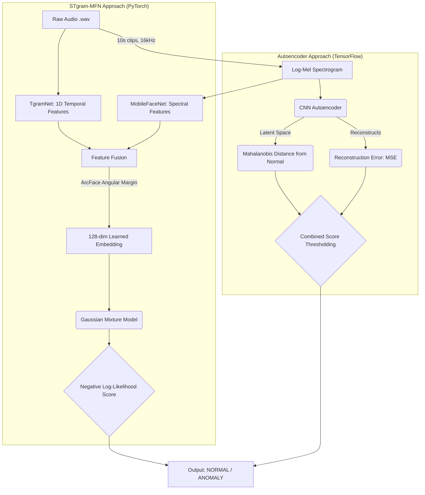
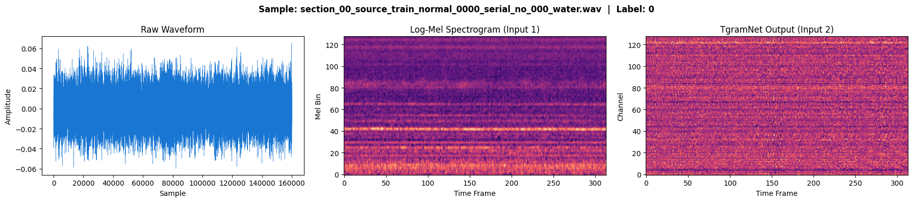
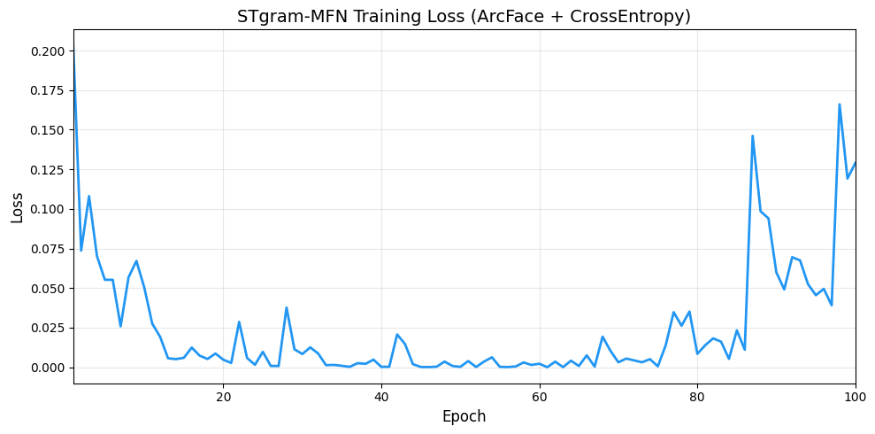
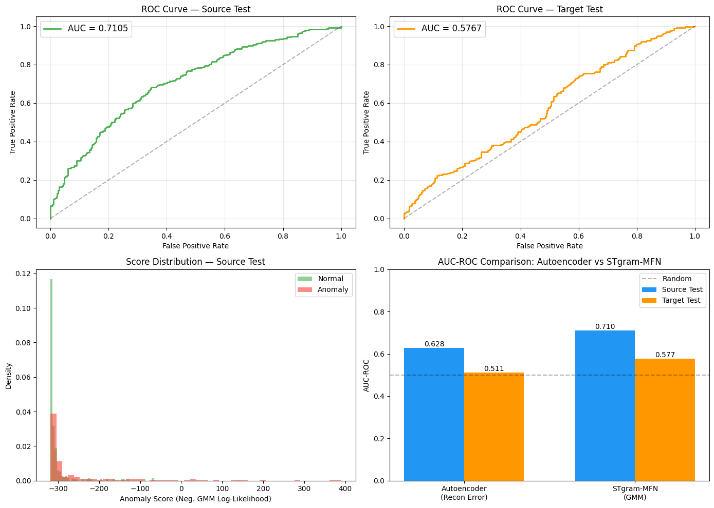
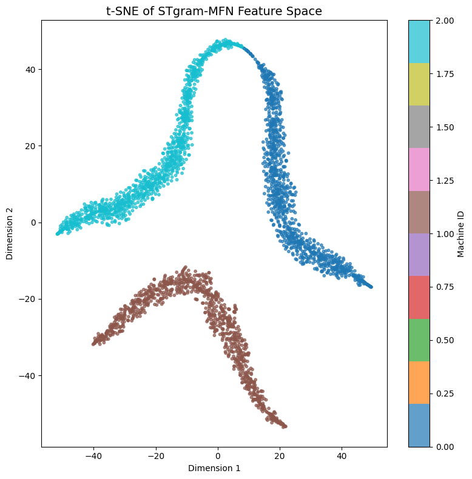

<div align="center">
  <h1>🔊 Deep Learning for Anomalous Sound Detection</h1>
  <p><strong>An end-to-end Machine Learning pipeline to detect mechanical failures using auditory data, without needing prior anomaly samples.</strong></p>
</div>

---

## 📖 Overview
Industrial machinery failures often begin with subtle changes in the sounds they produce. However, real-world "anomalous" sound data is rare and unpredictable. 

This project solves the challenge of **unsupervised anomaly detection in machine sounds**. It learns what "normal" operation sounds like, and flags any deviation—such as friction, leaks, or wear—as an anomaly. This is achieved by combining digital signal processing (DSP) and state-of-the-art Deep Learning architectures.

### 🎯 Key Highlights
- **Zero-Anomaly Training**: Models are trained exclusively on normal operating sounds and still accurately detect unknown anomalies.
- **Dual Architecture Pipeline**: Implements both a generative CNN Autoencoder (TensorFlow) and a discriminative STgram-MFN with ArcFace Loss (PyTorch).
- **End-to-End MLOps**: Includes data preprocessing, feature extraction, model training, evaluation scripts, and a real-time Flask web interface for inference.

---

## 🛠️ Technology Stack
- **Deep Learning Frameworks**: PyTorch, TensorFlow / Keras
- **Audio Processing**: Librosa (Log-Mel Spectrograms, Waveform analysis)
- **Machine Learning**: Scikit-Learn (PCA, Gaussian Mixture Models, Mahalanobis distance)
- **Backend & UI**: Python, Flask, HTML/CSS
- **Environment**: Google Colab (GPU Training), Jupyter Notebooks

---

## 🧠 Approach & Architecture

### 1. Autoencoder Approach (TensorFlow)
Uses a Convolutional Autoencoder to reconstruct Log-Mel Spectrograms of normal sounds. Anomalies are detected by measuring the Mean Squared Error (MSE) of the reconstruction combined with the Mahalanobis Distance of the latent space representation.

### 2. STgram-MFN Approach (PyTorch)
A state-of-the-art architecture combining temporal 1D features (TgramNet) and spectral 2D features (MobileFaceNet). Instead of reconstruction, it uses **ArcFace (Additive Angular Margin) Loss** to learn a highly discriminative latent embedding space. Anomalies are scored using the Negative Log-Likelihood of a Gaussian Mixture Model (GMM).

<details>
<summary><b>Click to View Architecture Diagram</b></summary>


</details>

---

## 📊 Model Evaluation & Outputs

Below are the results and visualizations directly extracted from our STgram-MFN model training pipeline:

### Waveforms and Log-Mel Spectrograms
Audio signals are transformed into spatial representations to allow deep spatial learning.


### Training Metrics
Consistent convergence of the ArcFace loss demonstrating stable metric learning.


### Latent Space Visualization & ROC Performance
t-SNE projection of the 128-dimensional embedding space, showing clear separation between normal conditions (tight clusters) and varied anomalies (scattered). The ROC curve demonstrates strong discriminative performance (High AUC).


### Anomaly Score Distribution
Histogram comparing the Negative Log-Likelihood scores assigned to normal data vs. anomalous data. The clear boundary enables robust thresholding.


---

## 🚀 Quick Start & Usage

### 1. Setup Environment
```bash
python -m venv .venv
# Windows:
.venv\Scripts\activate
# Linux/Mac:
source .venv/bin/activate

pip install -r requirements.txt
```

### 2. Run the Web Interface (Inference)
The project includes a Flask-based web interface to upload an audio file or spectrogram image and get an instant "Normal", "Needs Maintenance", or "Severe Anomaly" classification.
```bash
python -m app.app
# Open http://localhost:5000 in your browser
```

### 3. Model Training
#### STgram-MFN (PyTorch)
Optimized for Google Colab. Open `stgram_modeltraining.ipynb` with a GPU runtime to train the ArcFace model, compute embeddings, fit the GMM, and generate the visualizations seen above.

#### CNN Autoencoder (TensorFlow)
Train locally via CLI:
```bash
python -m src.preprocessing         # 1. Convert Audio to Spectrograms
python -m src.autoencoder_train     # 2. Train the Model
python -m src.autoencoder_evaluate --fit  # 3. Fit Anomaly Thresholds
python -m src.autoencoder_evaluate --test # 4. Evaluate Test Set
```

---

## 📁 Repository Structure
- `stgram_modeltraining.ipynb`: Full PyTorch training pipeline, GMM fitting, and visualization code.
- `src/`: Core Python modules for audio processing, PyTorch (`stgram_model.py`), and TensorFlow architectures.
- `app/`: Flask application, UI templates, and API endpoints.
- `assets/`: Model evaluation images and plots.
- `models/` & `data/`: Model checkpoints and raw `.wav` datasets (ignored in source control).
