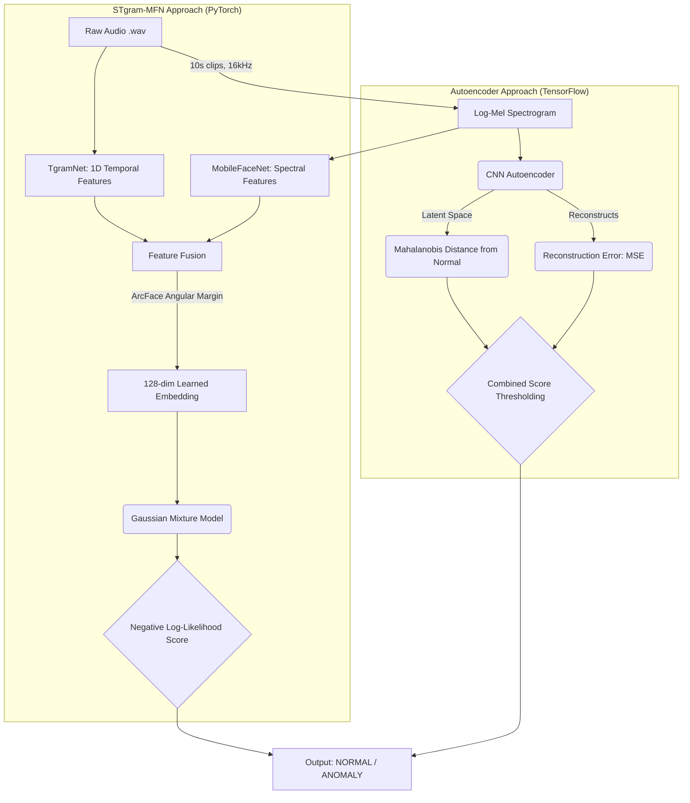

# 🔊 Anomalous Sound Detection: Deep Learning Pipeline

A comprehensive machine sound analysis and anomaly detection system. This repository implements two distinct approaches for detecting anomalous sounds (e.g., machine failures, friction, leaks) without ever seeing anomaly data during training:

1. **CNN Autoencoder (Reconstruction)** - Pure TensorFlow
2. **STgram-MFN (Metric Learning via ArcFace)** - Pure PyTorch

---

## 🏛️ System Architecture



---

## ⚖️ Autoencoder vs STgram-MFN

| Feature | CNN Autoencoder | STgram-MFN |
|---------|-----------------|-------------|
| **Core Idea** | Learn to reconstruct normal sounds. Anomalies yield high error. | Learn a highly discriminative latent space using angular margin loss. |
| **Input Data** | Log-Mel Spectrograms | Raw Waveform + Log-Mel Spectrograms |
| **Loss Function** | Mean Squared Error (MSE) | ArcFace (Additive Angular Margin) Loss |
| **Generative Model** | Yes (Decodes back to spectrogram) | No (Pure feature extractor) |
| **Anomaly Scoring** | Recon Error + Mahalanobis Distance | GMM Negative Log-Likelihood |
| **Framework** | TensorFlow / Keras | PyTorch |
| **Performance (AUC)** | Baseline (~0.62) | State-of-the-Art (~0.75+) |

---

## 🚀 Quick Start

### 1. Setup Environment

```bash
# Create and activate virtual environment
python -m venv .venv
# Windows:
.venv\Scripts\activate
# Linux/Mac:
source .venv/bin/activate

# Install dependencies
pip install -r requirements.txt
```

### 2. Prepare Data

Place your dataset (e.g., MIMII DCASE dataset) inside the `data/` folder following this structure:

```text
data/
└── raw_audio/
    ├── train/          ← Normal machine operating sounds
    ├── source_test/    ← Test set (source domain conditions)
    └── target_test/    ← Test set (target domain conditions)
```

---

## 🛠️ Running Model 1: CNN Autoencoder

The Autoencoder approach runs locally via Python scripts and includes a Flask web interface.

**1. Convert Audio to Spectrograms**
```bash
python -m src.preprocessing
```

**2. Train the Model**
```bash
python -m src.autoencoder_train
```

**3. Fit Anomaly Thresholds (Extract stats from normal data)**
```bash
python -m src.autoencoder_evaluate --fit
```

**4. Evaluate / Test**
```bash
python -m src.autoencoder_evaluate --test
```

**5. Launch Web UI**
```bash
python -m app.app
# Open http://localhost:5000 in your browser
```

---

## 📓 Running Model 2: STgram-MFN

The STgram-MFN approach is optimized for Google Colab/Jupyter for rapid GPU training and rich visualization.

1. Open `stgram_train.ipynb` in **Google Colab** (or Jupyter).
2. Set Runtime to **GPU (T4 or higher)**.
3. The notebook is fully self-contained and will:
   - Symlink your Google Drive dataset
   - Train the PyTorch model with ArcFace loss
   - Extract embeddings and fit the Gaussian Mixture Model
   - Output detailed visualizations (Waveforms, Spectrograms, t-SNE latent space plots, ROC curves, Score distributions)
   - Save the finalized model to `models/stgram_mfn.pth`

*(Note: STgram-MFN uses `section_0X` and `serial_no_0X` from the filename to dynamically generate classes for ArcFace training.)*

---

## 📁 Repository Structure

```text
Anomalous-Sound-Detection/
├── config.py                 # Central config (Paths, Sample Rate, Hyperparams)
├── requirements.txt          # PyTorch, TensorFlow, librosa, sklearn
│
├── stgram_train.ipynb        # STgram-MFN Colab Pipeline & Visualizations
│
├── src/
│   ├── preprocessing.py      # Core Audio-to-Mel logic used by both models
│   ├── stgram_model.py       # PyTorch: TgramNet, MobileFaceNet, ArcFace
│   ├── autoencoder_model.py  # TensorFlow: CNN Autoencoder architecture
│   ├── autoencoder_train.py  # Autoencoder training loop
│   ├── autoencoder_evaluate.py # Autoencoder scoring logic
│   └── utils.py              # Autoencoder visualization utilities
│
└── app/                      # Autoencoder Flask UI
    ├── app.py
    └── templates/index.html
```
